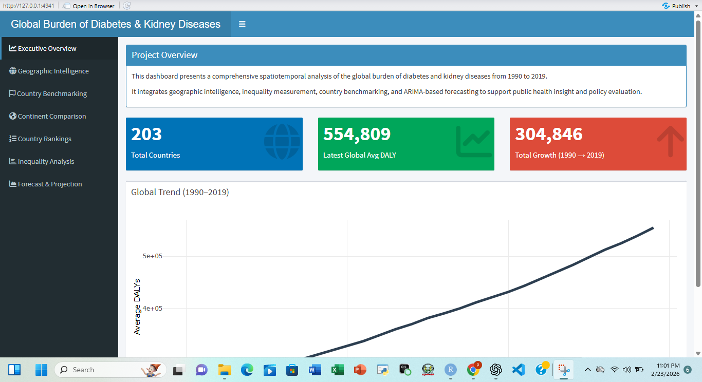

# 🌍 Global Diabetes Burden Intelligence System

📌 Overview

An interactive Shiny dashboard analyzing global diabetes burden trends using:

Time-series forecasting (ARIMA)

Inequality measurement (Gini coefficient)

Geospatial visualization (Leaflet)

Country benchmarking

Continent-level comparison

🛠 Tech Stack

R

Shiny

Tidyverse

Plotly

Leaflet

Forecast (ARIMA)

sf

rnaturalearth

### 📈 Analytical Methods Applied
- Time Series Modeling (ARIMA)
- Inequality Measurement (Gini Coefficient)
- Cross-country benchmarking
- Geospatial data integration
- Forecast modeling

📊 Key Features

Executive KPI dashboard

Interactive global choropleth map

Country ranking table

Inequality trend analysis

5-year ARIMA forecast projection

🎓 Academic Context

Developed as part of a Master's-level Data Science research project focused on global health analytics.
