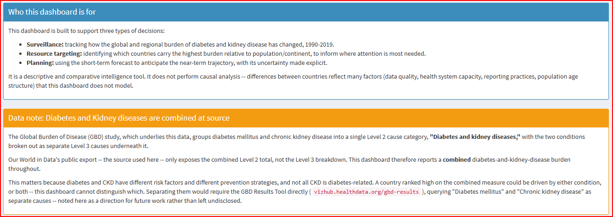
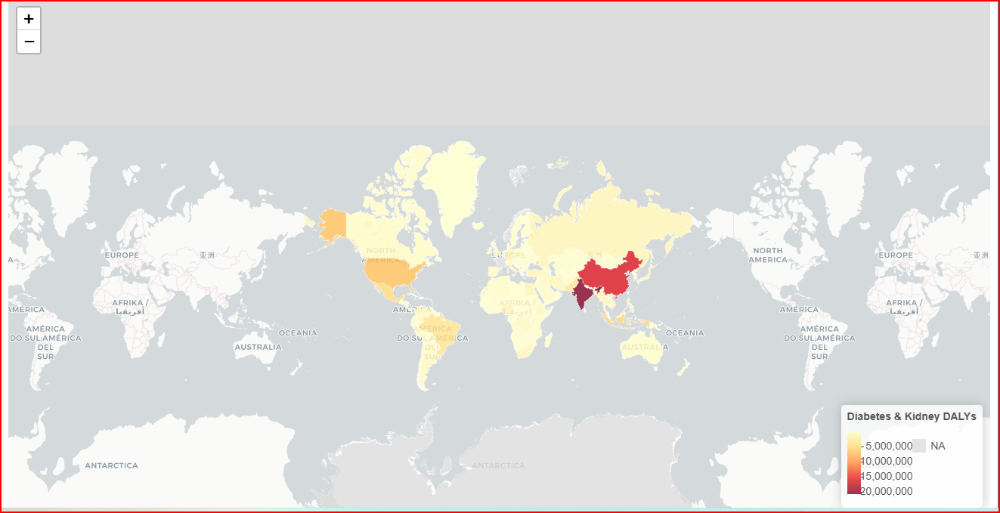
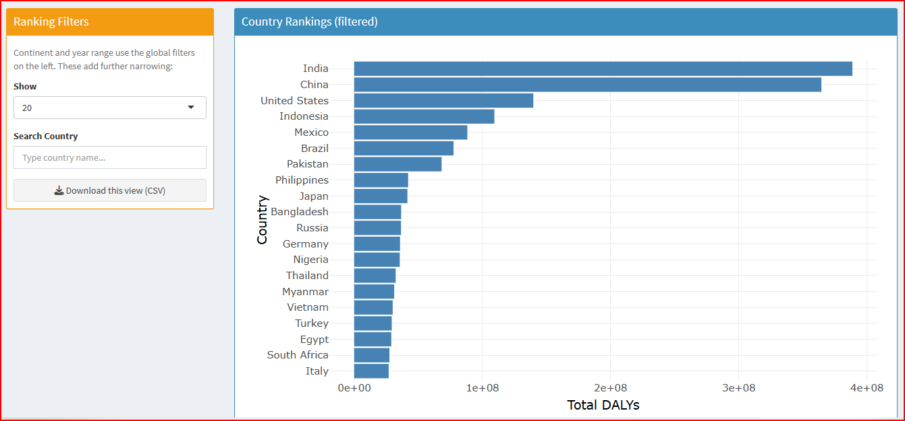
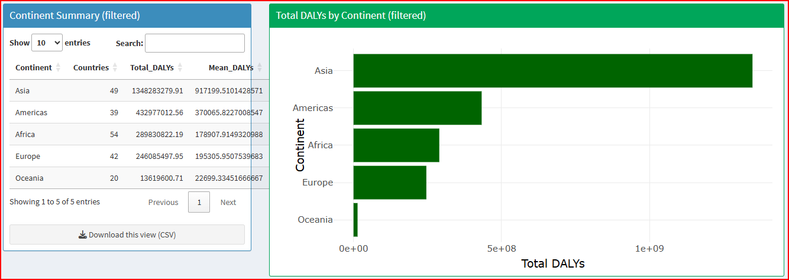
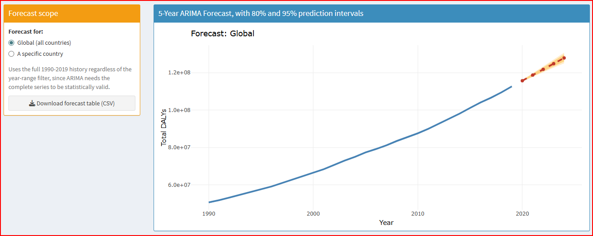

# 🌍 Global Diabetes Burden Intelligence Dashboard

An interactive R Shiny dashboard for exploring the global burden of diabetes using the Global Burden of Disease (GBD) dataset (1990–2019).

---

## 📌 Project Overview

This project was developed as part of my MSc in Data Science at the University of Nairobi.

The dashboard helps users explore:

- Global diabetes burden
- Country rankings
- Continental comparisons
- Geographic visualization
- Forecasting trends
- Interactive dashboards

The project demonstrates practical skills in data science, statistical computing, visualization, and dashboard development.

---

## 📊 Features

- Interactive R Shiny Dashboard
- Data Cleaning
- Exploratory Data Analysis (EDA)
- Choropleth World Maps
- Country Rankings
- Continent Comparison
- Forecasting using ARIMA
- Downloadable Tables
- Interactive Plotly Visualizations

---

## 🛠 Technologies Used

- R
- Shiny
- tidyverse
- ggplot2
- Plotly
- Leaflet
- forecast
- DT
- sf
- rnaturalearth

---

## 📂 Project Structure

```
global-diabetes-burden-intelligence/

│
├── data/
│   └── ncd_data_clean.csv
│
├── R/
│   ├── 01_data_preparation.R
│   ├── 02_exploratory_analysis.R
│   ├── 03_dashboard_datasets.R
│   └── 04_shiny_dashboard.R
│
├── report/
│   ├── Global_NCD_Report.pdf
│   └── images/
│
├── screenshots/
│
├── README.md
└── LICENSE
```

---

## 📸 Dashboard Screenshots

### Dashboard Home



---

### World Map



---

### Country Rankings



---

### Continent Summary



---

### Forecast



---

## 📈 Dataset

Global Burden of Disease (GBD)

Years Covered:

1990–2019

---

## 🎓 Academic Project

University of Nairobi

Master of Science in Data Science

Statistical Computing Project

---

## 👤 Author

Patrick Kipkoech

LinkedIn:

https://www.linkedin.com/in/kipkoech-patrick-ba6765387

GitHub:

https://github.com/patrickkipkoech119-blip

---

## 📜 License

MIT License
